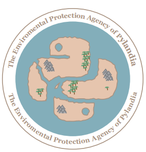
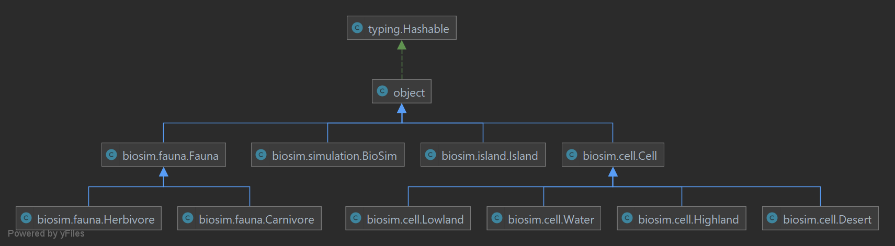
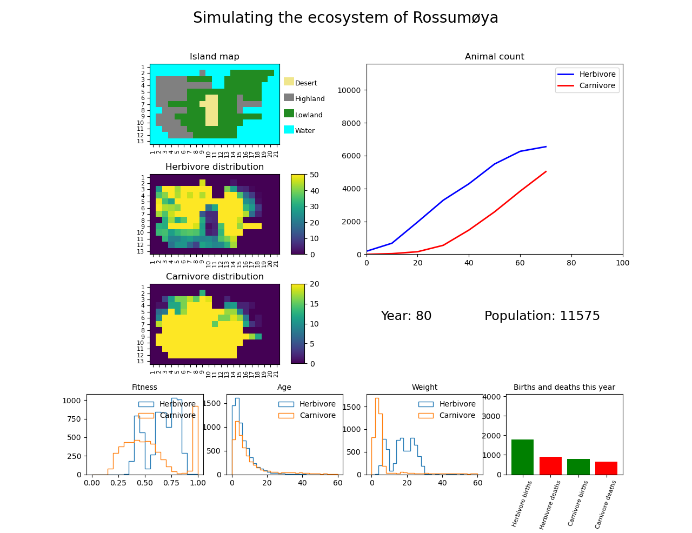

.. BioSim documentation master file, created by
   sphinx-quickstart on Tue Jun 15 15:02:01 2021.
   You can adapt this file completely to your liking, but it should at least
   contain the root `toctree` directive.

===============================================
 Modelling the Ecosystem of Rossumoeya
===============================================

*BioSim is a simulation program for wildlife interaction on the fictional island of Rossumoeya. Through the modules in
the biosim package, it allows the user to study the dynamics of the ecosystem over a given number of years. Through
various forms of visualization, one can study how the population on the island develops through the different annual
cycles. The various modules are thoroughly explained through docstrings and carefully tested using a composed library
of pytests.*

*In total, the package contains 4 different python-coded scripts, each of which consists of a class or a class and
several subclasses. In addition, the package comes with a __init__ file. BioSim is the result of a sixteen-day project
associated with the assessment in the course "Advanced Programming" (code: INF200) at the
Norwegian University of Life Sciences (NMBU).*

**Wildlife description**:

Herbivore
   Plant-eating animals that depend on enough access to fodder to gain weight and thus have a greater chance of avoiding
   being eaten by carnivores. Herbivores also want to reproduce themselves. The chances of giving birth increase the
   more herbivores there are in the same area and when the animal has a weight above a certain level.

Carnivore
   Carnivores rely on a good supply of herbivores to eat in order to survive and grow larger. Carnivores are more
   flexible about where on the island they are than herbivores, but they depend on getting the prey they hunt.
   As a breed, they are prone to extinction when there is an overpopulation of carnivores and a shortage of herbivores.

**Geography description**:

Water
   No place where animals can stay. The whole island is surrounded by areas of this type.

Desert
   In Desert areas, animals can stay, but no fodder for herbivores grows here. Carnivores, on the other hand, can hunt
   for herbivores in such areas.

Highland
   In such areas, food for herbivores grows and carnivores can hunt for herbivores. On the other hand, there is less
   annual fodder growth in highland areas than there is in lowland areas.

Lowland
   All animals can stay in this area and there is also a good amount of fodder for herbivores. Carnivores can also prey
   on herbivores.

**The annual cycle at Rossumoeya:**
      1. Feeding

         - first herbivores, then carnivores
      2. Procreation

         - animals can give birth
      3. Migration

         - animals moves between areas
      4. Aging

         - animals getting older
      5. Loss of weight

         - animals loosing weight every year
      6. Death

         - some animals will die because of weight loss

**Class inheritance diagram for biosim package**:

**Example of simulation represented as plot**:

.. toctree::
   :maxdepth: 2
   :caption: Contents:

   biosim
   tests

:Authors:
   Olav Vikoeren Espenes
   &
   Tage Andersen

:Version: 1.0.0 of 2021/05/15
:Acknowledgements: Many thanks to Professor Hans Ekkehard Plesser, and the teaching assistants for guidance and support
               throughout the autumn semester and during the project development period.

Indices and tables
==================

* :ref:`genindex`
* :ref:`modindex`
* :ref:`search`
